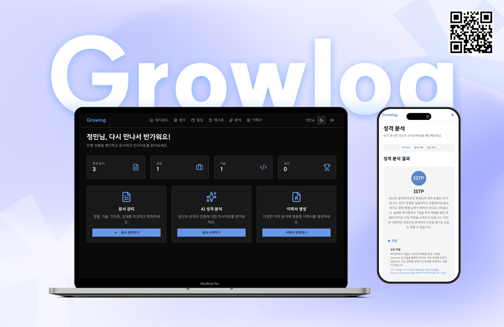

# Team 35 : GrowLog - 자기성장 플랫폼

Amazon Q Developer Hackathon에서 구현한 AI 기반 자기성장 및 커리어 개발 플랫폼입니다.

## 어플리케이션 개요

**GrowLog**는 "나를 기록하고, 탐구하고, 성장 과정을 시각화하여 자기인식과 커리어를 동시에 키우는 플랫폼"입니다.

사람은 자기 자신을 객관적으로 바라보기 힘듭니다. 그렇기 때문에 우리는 남의 시선을 빌리고 상담을 신청하기도 합니다.
그런 불편함을 해소하기 위해 사용자의 기록을 통해 자신을 돌아보고 성장시킬수 있는 AI 플랫폼을 제작했습니다.

### 핵심 가치

- **자기 인식 향상**: AI 분석을 통한 객관적인 성격 및 강점 파악
- **체계적 기록**: 경험과 성장을 구조화된 방식으로 문서화
- **커리어 연결**: 개인 데이터를 활용한 맞춤형 이력서 자동 생성
- **지속적 성장**: 시간에 따른 변화 추적 및 개선 방향 제시

## 주요 기능

### 1. 📝 체계적 문서 관리 시스템


- **다양한 문서 타입**: 경험, 스킬, 가치관, 성취, 일상 기록 등
- **실시간 자동 저장**: 작성 중 데이터 손실 방지
- **Rich Text Editor**: TipTap 기반 고급 텍스트 편집 기능
- **태그 및 카테고리**: 체계적인 문서 분류 및 검색

### 2. 🤖 AI 기반 성격 분석


- **AWS Bedrock Claude 3.5 Sonnet**: 고도화된 AI 모델 활용
- **다차원 분석**: 성격 유형, 강점, 가치관, 관심사 종합 분석
- **성장 패턴 추적**: 시간에 따른 변화 및 발전 방향 제시
- **개선 제안**: 개인 맞춤형 성장 가이드라인 제공

### 3. 📄 자동 이력서 생성


- **직무별 맞춤화**: 개발자, PM, 디자이너, 마케터 등 직무별 최적화
- **개인화된 콘텐츠**: 사용자의 모든 데이터를 활용한 맞춤형 이력서
- **다양한 템플릿**: 업계 표준에 맞는 다양한 형식 지원
- **실시간 미리보기**: 생성된 이력서 즉시 확인 및 수정

### 4. 🔐 안전한 사용자 관리


- **JWT 기반 인증**: 보안성이 검증된 토큰 기반 인증
- **개인 데이터 보호**: 사용자별 완전 격리된 데이터 관리
- **자동 세션 관리**: 토큰 갱신 및 보안 세션 유지

## 동영상 데모

<iframe width="560" height="315" src="https://www.youtube.com/embed/c1gavi2Ce1o?si=e9qVGMzQ32d-zig8" title="YouTube video player" frameborder="0" allow="accelerometer; autoplay; clipboard-write; encrypted-media; gyroscope; picture-in-picture; web-share" referrerpolicy="strict-origin-when-cross-origin" allowfullscreen></iframe>

_전체 사용자 플로우: 회원가입 → 문서 작성 → AI 분석 → 이력서 생성_

## 리소스 배포하기

### 1. 사전 요구 사항

- AWS CLI 설치 및 구성
- Node.js (>= 18.x)
- AWS CDK CLI 설치: `npm install -g aws-cdk`
- 적절한 AWS 권한 (DynamoDB, Lambda, API Gateway, S3, CloudFront, Cognito, Bedrock)

### 2. 인프라 배포

```bash
# 1. 저장소 클론
git clone https://github.com/your-team/team35-aws-hackathon.git
cd team35-aws-hackathon

# 2. 인프라 배포
cd iac
npm install

# CDK 부트스트랩 (최초 1회만)
cdk bootstrap

# 인프라 배포
cdk deploy --all
```

### 3. 백엔드 배포

```bash
# 백엔드 Lambda 함수 배포
cd ../backend
npm install
npm run build

# Lambda 함수 업데이트 (배포 후)
npm run deploy
```

### 4. 프론트엔드 배포

```bash
# 프론트엔드 빌드 및 배포
cd ../code
npm install

# 환경 변수 설정 (.env.local)
NEXT_PUBLIC_API_URL=<API_GATEWAY_URL>
NEXT_PUBLIC_USER_POOL_ID=<COGNITO_USER_POOL_ID>
NEXT_PUBLIC_USER_POOL_CLIENT_ID=<COGNITO_USER_POOL_CLIENT_ID>

# 빌드 및 S3 배포
npm run build
aws s3 sync out/ s3://<S3_BUCKET_NAME>/
```

### 5. AWS 아키텍처

배포 완료 후 다음과 같은 AWS 리소스가 생성됩니다:

```
┌─────────────┐    ┌──────────────┐    ┌─────────────┐
│ CloudFront  │────│ S3 (Frontend)│    │   Cognito   │
│   (CDN)     │    │  (Hosting)   │    │   (Auth)    │
└─────────────┘    └──────────────┘    └─────────────┘
       │                    │                   │
       ▼                    ▼                   ▼
┌─────────────┐    ┌──────────────┐    ┌─────────────┐
│   Users     │────│ API Gateway  │────│   Lambda    │
│             │    │   (REST)     │    │ Functions   │
└─────────────┘    └──────────────┘    └─────────────┘
                            │                   │
                            ▼                   ▼
                   ┌──────────────┐    ┌─────────────┐
                   │   Bedrock    │    │  DynamoDB   │
                   │ (AI Analysis)│    │ (Database)  │
                   └──────────────┘    └─────────────┘
```

### 6. 배포 결과 확인

배포 완료 후 다음 정보들이 출력됩니다:

- **CloudFront URL**: 웹사이트 접근 주소
- **API Gateway URL**: REST API 엔드포인트
- **S3 Bucket Name**: 프론트엔드 호스팅 버킷
- **Cognito User Pool ID**: 사용자 인증 풀

### 7. 리소스 정리

```bash
# 모든 AWS 리소스 삭제
cd iac
cdk destroy --all

# S3 버킷 수동 정리 (필요시)
aws s3 rm s3://<bucket_name> --recursive
```

## 프로젝트 기대 효과 및 예상 사용 사례

### 기대 효과

1. **개인 성장 가속화**

   - 체계적인 자기 기록을 통한 객관적 자기 인식 향상
   - AI 분석 기반 개인 맞춤형 성장 방향 제시
   - 지속적인 피드백 루프를 통한 꾸준한 발전

2. **커리어 개발 효율성 증대**

   - 개인 데이터 기반 맞춤형 이력서 자동 생성으로 지원 시간 단축
   - 직무별 최적화된 콘텐츠로 채용 성공률 향상
   - 일관된 개인 브랜딩 및 스토리텔링 지원

3. **데이터 기반 의사결정**
   - 감정이나 추측이 아닌 축적된 데이터 기반 커리어 결정
   - 강점과 약점의 객관적 파악을 통한 전략적 역량 개발
   - 시간에 따른 성장 추적으로 발전 방향 검증

### 예상 사용 사례

#### 1. 대학생 및 취업 준비생

- **포트폴리오 관리**: 프로젝트, 인턴십, 동아리 활동 체계적 기록
- **자기소개서 작성**: AI 분석 기반 개인 스토리 발굴 및 구성
- **진로 탐색**: 다양한 경험 분석을 통한 적성 및 관심 분야 발견

#### 2. 직장인 및 경력 개발자

- **이직 준비**: 현재 역량 분석 및 목표 직무 맞춤 이력서 생성
- **승진 준비**: 성과 및 성장 과정 문서화로 평가 자료 준비
- **커리어 전환**: 기존 경험 재해석을 통한 새로운 분야 진출 전략

#### 3. 프리랜서 및 창업가

- **개인 브랜딩**: 일관된 개인 스토리 및 전문성 어필
- **클라이언트 제안**: 프로젝트별 맞춤형 포트폴리오 및 제안서 생성
- **네트워킹**: 명확한 자기 정체성 기반 효과적인 관계 구축

#### 4. 교육 및 코칭 분야

- **학습자 분석**: 개인별 학습 패턴 및 성향 파악
- **맞춤형 교육**: 개인 특성 기반 최적화된 교육 프로그램 설계
- **진로 상담**: 데이터 기반 객관적 진로 가이드 제공

#### 5. HR 및 채용 담당자

- **인재 평가**: 지원자의 성장 패턴 및 잠재력 분석
- **조직 문화 매칭**: 개인 가치관과 조직 문화 적합성 평가
- **온보딩 최적화**: 신입 직원 특성 기반 맞춤형 적응 프로그램

### 사회적 임팩트

- **교육 격차 해소**: AI 기반 개인 맞춤 분석으로 전문 상담 서비스 접근성 향상
- **취업 시장 효율성**: 개인-직무 매칭 정확도 향상으로 미스매치 감소
- **평생 학습 문화**: 지속적 자기 개발 및 성장 마인드셋 확산
- **데이터 리터러시**: 개인 데이터 활용 능력 및 인사이트 도출 역량 향상

이러한 다양한 활용을 통해 GrowLog는 개인의 성장과 사회 전체의 인적 자원 효율성 향상에 기여할 것으로 기대됩니다.


